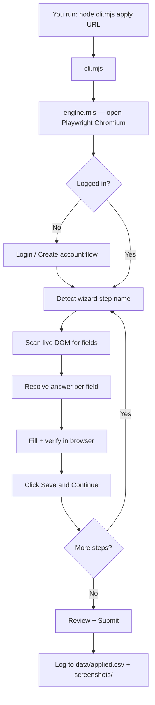
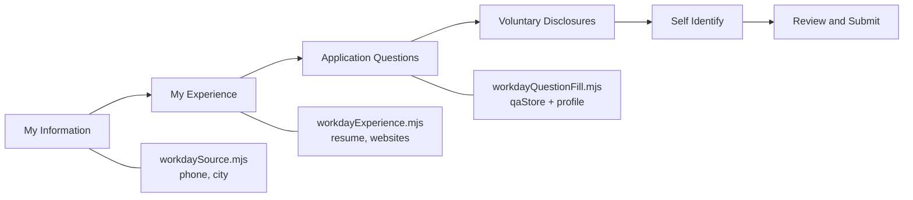
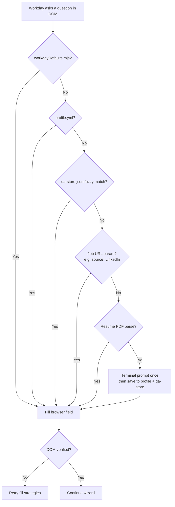
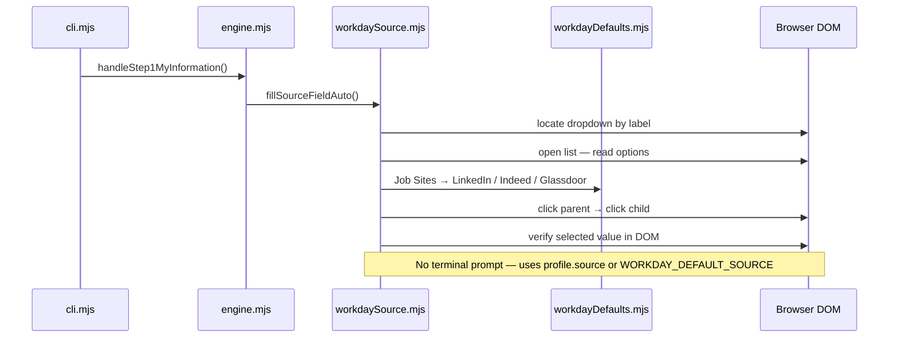
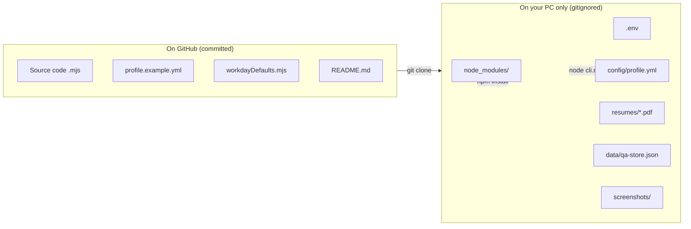

# Workday Auto

[](https://github.com/ajithchandraapplywizz/Workday_Auto)

Playwright-based bot that applies to **Workday** job postings on your machine. It opens a real browser, reads each wizard step from the live DOM, fills fields from your profile and saved defaults, and clicks **Save and Continue** until submit.

**Repository:** https://github.com/ajithchandraapplywizz/Workday_Auto  
**App code:** `workday-auto-apply/auto-apply/`
---

## What you need locally

| Requirement | Notes |
|-------------|--------|
| **Node.js 18+** | `node -v` |
| **npm** | Comes with Node |
| **Chromium (Playwright)** | Installed once via `npx playwright install chromium` |
| **Your profile + resume** | Local files only — never committed to Git |

---

## First-time setup (after cloning from GitHub)

```powershell
# 1. Clone
git clone https://github.com/ajithchandraapplywizz/Workday_Auto.git
cd Workday_Auto

# 2. Install Node dependencies (NOT committed — you install locally)
cd workday-auto-apply\auto-apply
npm install
npx playwright install chromium

# 3. Create your local profile (NOT committed — stays on your PC only)
node cli.mjs setup
```

> **Note:** `node_modules/`, `.env`, and `config/profile.yml` are **gitignored**. They never go to GitHub. Each machine runs `npm install` and `node cli.mjs setup` after clone.

Edit `config/profile.yml` with your real name, email, phone, LinkedIn, experience, education, etc.

Copy the example resume config and add your PDF:

```powershell
copy config\resumes.example.yml config\resumes.yml
# Put your PDF in resumes\ and point resumes.yml at it
```

Optional: copy `targets.example.txt` → `targets.txt` for batch mode (one Workday URL per line).

---

## Run a single job (most common)

```powershell
cd workday-auto-apply\auto-apply
node cli.mjs apply "https://company.wd5.myworkdayjobs.com/en-US/.../job/..."
```

- The browser opens **visibly** (not headless) so you can watch.
- When finished, check `screenshots/` and `data/applied.csv` for results.

---

## How the system works (local flow)

### 1. End-to-end apply pipeline

Paste this in any Mermaid viewer, or view on GitHub (renders automatically):



### 2. Workday wizard steps (order)



### 3. Where each answer comes from



### 4. “How did you hear about us?” (source dropdown)



### 5. Code entry point (what runs when you apply)

```text
workday-auto-apply/auto-apply/
│
├── cli.mjs                          ← you run this
│     └── apply(url)
│           └── lib/engine.mjs       ← main loop
│                 ├── handleStep1MyInformation()   → workdaySource.mjs, workdayCity.mjs
│                 ├── handleStep2MyExperience()      → workdayExperience.mjs, workdayWebsites.mjs
│                 ├── handleWorkdayFormFieldQuestions() → workdayQuestionFill.mjs
│                 └── advanceWorkdayStep()           → Save and Continue
│
├── lib/workdayDefaults.mjs          ← default answers (LinkedIn, Hyderabad, experience…)
├── config/profile.yml               ← YOUR answers (local only, gitignored)
└── data/qa-store.json               ← learned answers (local only, gitignored)
```

### 6. Example: what lives in your local profile

```yaml
# config/profile.yml  (created by: node cli.mjs setup)
personal:
  first_name: "Ajith"
  email: "you@email.com"
  phone: "8052875631"
  linkedin: "https://www.linkedin.com/in/yourprofile"
  city: "Hyderabad"
  source: "LinkedIn"          # used for "How did you hear about us?"

experience:
  current_title: "Full stack Intern"
  current_company: "Student spot"
  from_date: "06/2025"
  to_date: "08/2025"

education:
  university: "Other"
  degree: "Bachelor's"
  major: "Computer Science"
  from_year: "2022"
  to_year: "2026"
```

### 7. Example: defaults in code (committed to GitHub)

```javascript
// lib/workdayDefaults.mjs (excerpt — everyone gets these unless profile overrides)
export const WORKDAY_DEFAULT_SOURCE = 'LinkedIn';

export const WORKDAY_SOURCE_HIERARCHICAL_PREFERENCES = [
  ['Job Sites', 'LinkedIn'],
  ['Job Sites', 'Indeed'],
  ['Job Sites', 'Glassdoor'],
  ['Job Boards', 'LinkedIn'],
  // ...
];

export const WORKDAY_DEFAULT_EXPERIENCE = {
  current_title: 'Full stack Intern',
  current_company: 'Student spot',
  location: 'Hybrid',
  from_date: '06/2025',
  to_date: '08/2025',
};
```

### 8. Local machine vs GitHub (what syncs)



### Wizard steps handled today

| Step | What the bot does |
|------|-------------------|
| **My Information** | Source dropdown (LinkedIn / Job Sites), phone, city, address, prior worker |
| **My Experience** | Work Experience 1, Education 1, resume upload, Websites URL (or delete empty row) |
| **Application Questions** | DOM scan + profile / Q&A cache |
| **Voluntary Disclosures** | EEO-style dropdowns from profile |
| **Review / Submit** | Fill gaps, screenshot, submit |

Step-specific logic lives in `lib/engine.mjs` plus helpers like `workdaySource.mjs`, `workdayExperience.mjs`, `workdayCity.mjs`, `workdayWebsites.mjs`.

---

## Where answers come from (priority order)

1. **`lib/workdayDefaults.mjs`** — built-in defaults (e.g. source = LinkedIn via Job Sites, city = Hyderabad, experience/education templates).
2. **`config/profile.yml`** — your personal data (`personal`, `experience`, `education`, `eeo`, `work_auth`, `qa_answers`).
3. **`data/qa-store.json`** — answers learned from past runs (created locally after you answer something once).
4. **Job URL** — e.g. `?source=web_LinkedIn` → LinkedIn for “How did you hear about us?”
5. **Terminal prompt** — only if nothing above matches (salary and unknown required questions).

“How did you hear about us?” is filled **automatically** from defaults/profile/URL — it should not ask in the terminal during normal runs.

---

## Important local files

```
workday-auto-apply/auto-apply/
├── cli.mjs                 # Entry point — all commands
├── config/
│   ├── profile.yml         # YOUR data (gitignored — create from profile.example.yml)
│   ├── profile.example.yml # Template committed to repo
│   ├── resumes.yml         # Which PDF to upload (gitignored)
│   └── tenant-overrides/   # Per-company field tweaks (bah.yml, etc.)
├── lib/
│   ├── engine.mjs          # Main fill loop + wizard navigation
│   ├── workdayDefaults.mjs # Default answers (source, experience, education)
│   ├── workdaySource.mjs   # “How did you hear about us?” dropdown
│   ├── workdayExperience.mjs # Work + education sections
│   ├── workdayWebsites.mjs # Websites URL fill or delete empty row
│   ├── planner.mjs         # Label → profile field mapping
│   └── qaStore.mjs         # Fuzzy Q&A memory
├── resumes/                # PDF files (gitignored)
├── data/
│   ├── applied.csv         # Run log (gitignored)
│   └── qa-store.json       # Learned answers (gitignored)
└── screenshots/            # Debug captures (gitignored)
```

**Handoff doc for developers/agents:** `workday-auto-apply/SESSION-CHECKPOINT.md`

---

## Commands

Run from `workday-auto-apply/auto-apply/`:

| Command | Purpose |
|---------|---------|
| `node cli.mjs setup` | Create `config/profile.yml` from example |
| `node cli.mjs apply <url>` | Full apply pipeline for one job |
| `node cli.mjs batch` | Apply to every URL in `targets.txt` |
| `node cli.mjs queue add <url>` | Add job to queue |
| `node cli.mjs queue list` | Show queue |
| `node cli.mjs status` | Application stats |
| `node cli.mjs scan <url>` | Scan form fields only (debug) |

From **repo root**, the same commands work via npm scripts:

```powershell
npm run apply -- "https://..."
npm run batch
npm run setup
```

---

## Parallel runs (multiple companies at once)

You can open **multiple terminals** and run different `apply` URLs in parallel. Each run uses its own browser profile.

Tips:

- Use separate terminals — do not share one terminal session.
- Each run writes to the same `data/applied.csv` and `qa-store.json`; avoid editing `profile.yml` mid-run.
- Source / experience defaults come from `workdayDefaults.mjs` so parallel runs should not block on terminal input for common fields.

---

## What is NOT in Git (and should stay local)

| Ignored | Why |
|---------|-----|
| `node_modules/` | Install with `npm install` |
| `.env` | Secrets / credentials |
| `config/profile.yml` | Personal info |
| `config/resumes.yml` | Resume paths |
| `resumes/*.pdf` | Your resume files |
| `data/applied.csv`, `data/qa-store.json` | Runtime logs & learned answers |
| `screenshots/` | Browser captures |

---

## Troubleshooting

| Problem | What to try |
|---------|-------------|
| Browser does not open | `npx playwright install chromium` |
| Field not filling | Check terminal logs (`┌── Section › Field ──` blocks); update `profile.yml` or `workdayDefaults.mjs` |
| Stuck on same step | See `screenshots/workday-step-*.png`; read validation errors in terminal |
| `git push` auth failed | `gh auth login` then `git push -u origin main` |

---

## Updating code on GitHub (for developers)

```powershell
cd C:\path\to\Workday_Auto
git add .
git status          # confirm no profile.yml, .env, or node_modules listed
git commit -m "your message"
git push origin main
```

Authenticate once with `gh auth login` if push asks for credentials.

---

## License

MIT — see `workday-auto-apply/auto-apply/README.md` for deeper architecture notes.
