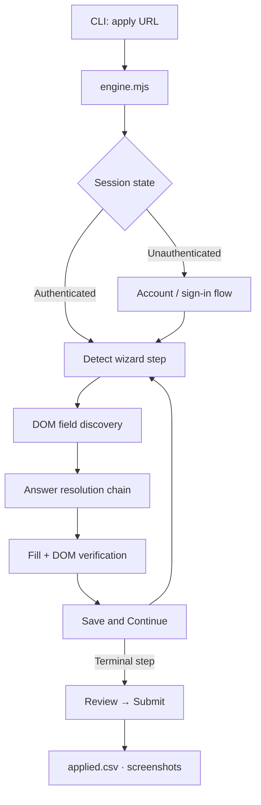
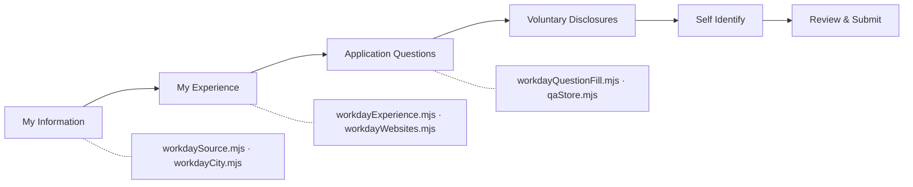
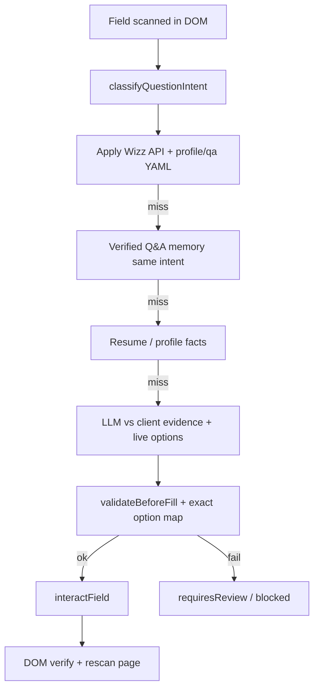
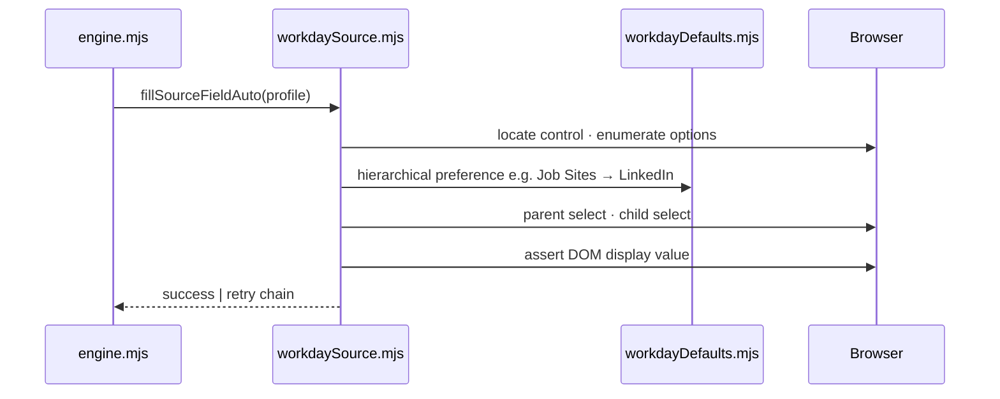
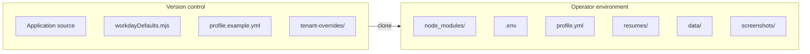

# Workday Auto

[](https://nodejs.org/)
[](https://playwright.dev/)
[](LICENSE)

**Workday Auto** is a local-first automation engine for Workday job applications. It drives a real Chromium session via Playwright, interprets each wizard step from the live DOM, resolves field values from a layered configuration model, and advances the application through submission—with DOM verification at every interaction.

| | |
|---|---|
| **Repository** | [github.com/ajithchandraapplywizz/Workday_Auto](https://github.com/ajithchandraapplywizz/Workday_Auto) |
| **Application root** | `workday-auto-apply/auto-apply/` |
| **Runtime** | Node.js 18+, Playwright Chromium |
| **Scope** | Workday tenants only (`*.myworkdayjobs.com`) |

---

## Overview

The system implements **scan → intent → evidence → validate → fill → verify → rescan → advance** on every wizard page (`runWorkdayPageWorkflow`). Field detection is DOM-native. Answers come from **Apply Wizz API/YAML first**, then verified Q&A memory (intent-matched), resume facts, then LLM analysis against that evidence—**no mid-run human prompts** in normal apply mode and no keyword-only matching.

Design principles:

- **DOM-first** — no blind fills; values are validated against the live page before advancing.
- **Layered configuration** — tenant defaults, user profile, and learned answers with explicit precedence.
- **Local execution** — credentials, PII, and runtime artifacts remain on the operator’s machine.
- **Observable runs** — headed browser, structured terminal output, screenshots, and CSV audit log.

---

## Architecture

### Application pipeline



### Wizard coverage



| Wizard step | Primary modules | Responsibility |
|-------------|-----------------|----------------|
| My Information | `workdaySource.mjs`, `workdayCity.mjs` | Referral source (hierarchical dropdown), phone, address, city |
| My Experience | `workdayExperience.mjs`, `workdayWebsites.mjs` | Work history, education, resume upload, websites URL |
| Application Questions | `workdayQuestionFill.mjs`, `planner.mjs` | Tenant-specific questions via DOM scan |
| Voluntary Disclosures | `workdayQuestionFill.mjs` | EEO / compliance fields from profile |
| Review & Submit | `engine.mjs` | Gap fill, cross-check, submission |

### Answer resolution (intent + evidence + validation)



**Precedence (highest to lowest):**

1. **Apply Wizz** client API + hydrated `config/profile.yml` / `qa_answers` / tenant YAML.
2. **Verified local Q&A** — reuse only when semantic **intent** matches (not label fuzzy match alone).
3. **Resume PDF** — factual fields tied to intent (never invented compliance/salary).
4. **LLM** (OpenRouter) — selects from evidence-backed options; no fabrication.
5. **Blocked** — missing or low-confidence evidence stops the step (optional `FORM_ANSWER_TERMINAL=1` for dev only).

Referral source (`How did you hear about us?`) is filled via `fillSourceFieldAuto()` using configured hierarchy, separate from the question-engine pipeline.

### Referral source interaction



### Repository vs. runtime boundary



---

## Installation

**Prerequisites:** Node.js ≥ 18, npm, Git.

```powershell
git clone https://github.com/ajithchandraapplywizz/Workday_Auto.git
cd Workday_Auto\workday-auto-apply\auto-apply
npm install
npx playwright install chromium
node cli.mjs setup
```

`setup` materializes `config/profile.yml` from `config/profile.example.yml`. Configure resume routing:

```powershell
copy config\resumes.example.yml config\resumes.yml
```

Place the PDF under `resumes/` and reference it in `resumes.yml`. For batch processing, initialize `targets.txt` from `targets.example.txt`.

---

## Configuration

### Profile schema (`config/profile.yml`)

```yaml
personal:
  first_name: ""
  last_name: ""
  email: ""
  phone: ""
  linkedin: ""
  city: "Hyderabad"
  source: "LinkedIn"

experience:
  current_title: "Full stack Intern"
  current_company: "Student spot"
  location: "Hybrid"
  from_date: "06/2025"
  to_date: "08/2025"
  description: ""

education:
  university: "Other"
  degree: "Bachelor's"
  major: "Computer Science"
  from_year: "2022"
  to_year: "2026"

eeo: { ... }
work_auth: { ... }
qa_answers: { ... }
```

### Default policy (`lib/workdayDefaults.mjs`)

Committed defaults govern cross-tenant behavior unless overridden by profile:

```javascript
export const WORKDAY_DEFAULT_SOURCE = 'LinkedIn';

export const WORKDAY_SOURCE_HIERARCHICAL_PREFERENCES = [
  ['Job Sites', 'LinkedIn'],
  ['Job Sites', 'Indeed'],
  ['Job Sites', 'Glassdoor'],
  ['Job Boards', 'LinkedIn'],
];
```

Per-tenant field overrides live in `config/tenant-overrides/` (e.g. `bah.yml`).

---

## Operations

### CLI reference

Execute from `workday-auto-apply/auto-apply/`:

| Command | Description |
|---------|-------------|
| `node cli.mjs setup` | Initialize local profile from template |
| `node cli.mjs apply <url>` | Execute full apply pipeline for one posting |
| `node cli.mjs batch` | Process all URLs in `targets.txt` |
| `node cli.mjs queue add <url>` | Enqueue a posting |
| `node cli.mjs queue list` | List queued postings |
| `node cli.mjs status` | Aggregate run statistics |
| `node cli.mjs scan <url>` | DOM field discovery only (diagnostic) |

Repository root exposes npm aliases: `npm run apply`, `npm run batch`, `npm run setup`.

### Single application

```powershell
node cli.mjs apply "https://{tenant}.wd{N}.myworkdayjobs.com/en-US/{site}/job/{id}/apply"
```

The engine runs in **headed** mode by default. Outputs:

- `data/applied.csv` — run outcome per URL
- `screenshots/` — step captures and post-submit state

### Concurrent execution

Multiple `apply` invocations may run in parallel across separate terminal sessions. Each session maintains an isolated browser context. Shared mutable state (`data/qa-store.json`, `data/applied.csv`) is file-based; avoid concurrent writes to `config/profile.yml` during active runs.

---

## Module map

```
workday-auto-apply/auto-apply/
├── cli.mjs                      Entry point
├── lib/
│   ├── engine.mjs               Orchestration · wizard navigation
│   ├── workdayDefaults.mjs      Default answers · source hierarchy
│   ├── workdaySource.mjs        Referral source dropdown
│   ├── workdayExperience.mjs    Work experience · education
│   ├── workdayCity.mjs          Address city field
│   ├── workdayWebsites.mjs      Websites section (fill or remove)
│   ├── workdayQuestionFill.mjs  Generic form-field handler
│   ├── workdayDom.mjs           DOM discovery utilities
│   ├── planner.mjs              Label → profile path mapping
│   └── qaStore.mjs              Fuzzy Q&A persistence
├── config/
│   ├── profile.example.yml      Committed template
│   ├── profile.yml              Local operator config (gitignored)
│   └── tenant-overrides/        Per-tenant YAML overrides
└── data/                        Runtime artifacts (gitignored)
```

Internal handoff documentation: `workday-auto-apply/SESSION-CHECKPOINT.md`.

---

## Security & data handling

The following paths are excluded from version control and must not be committed:

| Path | Classification |
|------|----------------|
| `node_modules/` | Build artifact |
| `.env`, `.env.*` | Secrets |
| `config/profile.yml` | PII |
| `config/resumes.yml`, `resumes/*.pdf` | PII |
| `data/qa-store.json`, `data/applied.csv` | Operational / PII |
| `screenshots/` | Operational |

---

## Diagnostics

| Symptom | Resolution |
|---------|------------|
| Chromium fails to launch | `npx playwright install chromium` |
| Field not persisting after fill | Inspect structured logs (`┌── Section › Field ──`); update profile or `workdayDefaults.mjs` |
| Wizard step loop | Review `screenshots/workday-step-*.png` and terminal validation output |
| Git authentication failure | `gh auth login` · verify remote `origin` URL |

---

## Development

```powershell
git add .
git status    # confirm no gitignored paths staged
git commit -m "description"
git push origin main
```

Extended architecture notes: `workday-auto-apply/auto-apply/README.md` · `workday-auto-apply/CODEBASE-ANALYSIS.md`.

---

## License

MIT
