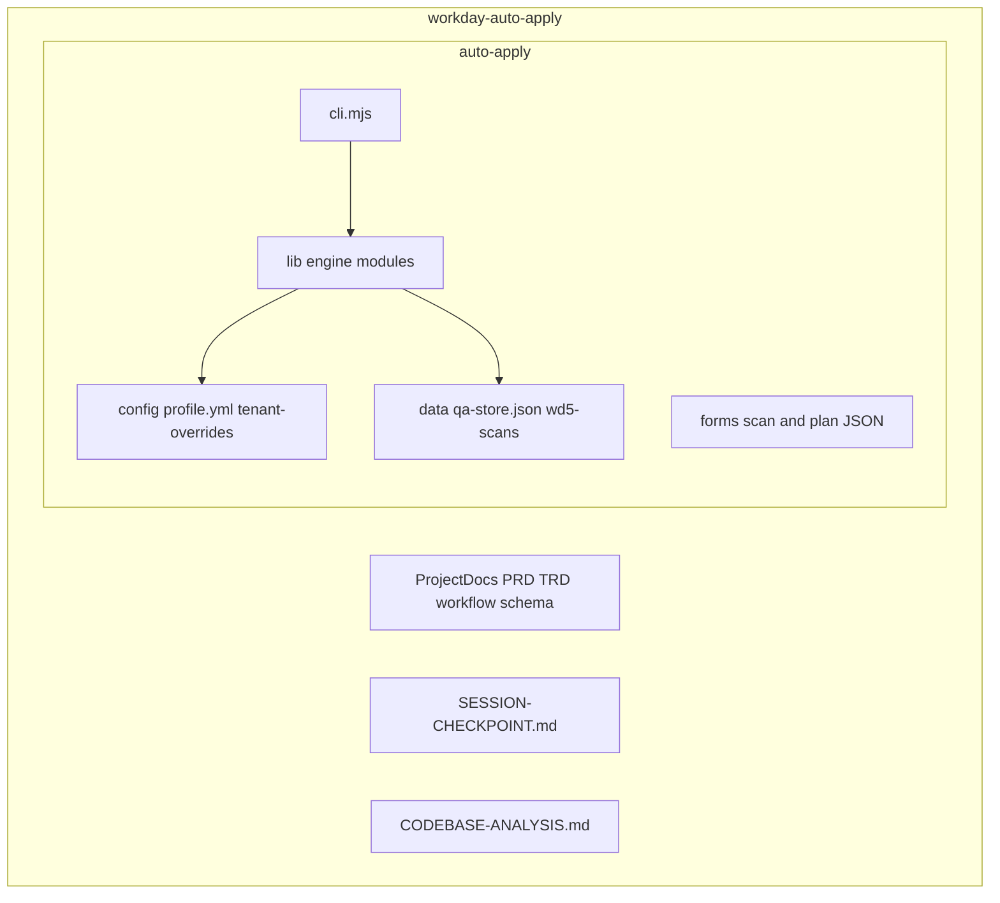
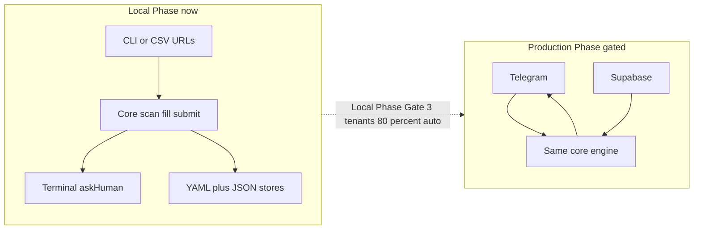
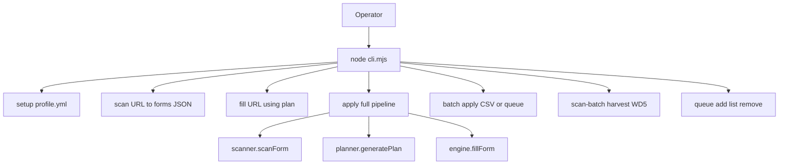
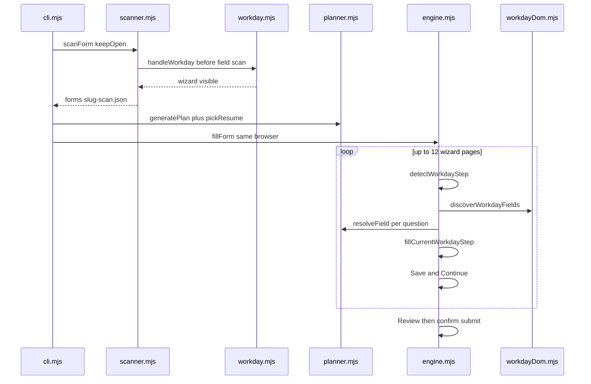
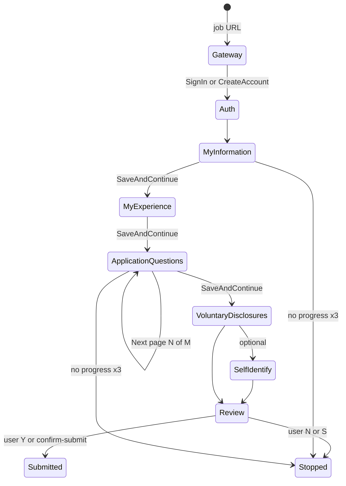
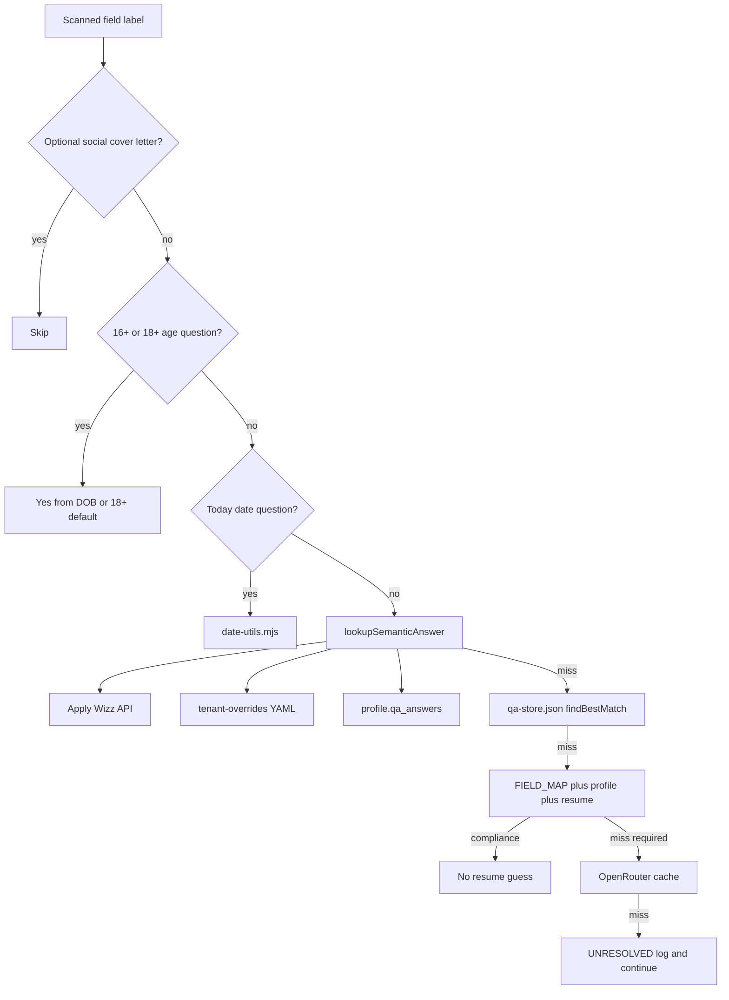
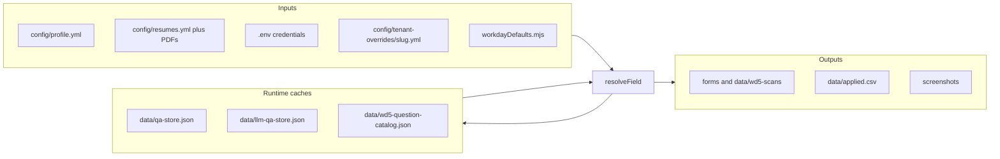
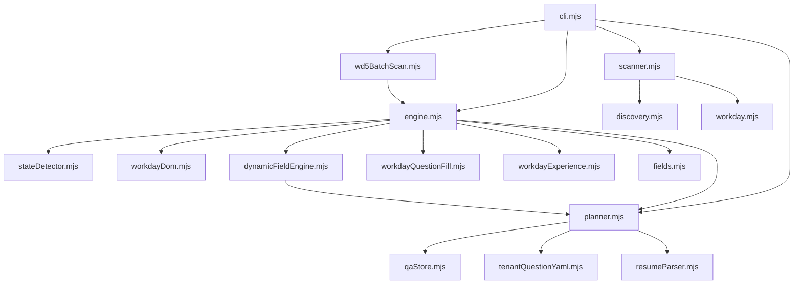

# Codebase Analysis Report — workday-auto-apply

> **Purpose:** Source of truth for what the code does **now**. Specs live in `ProjectDocs/`. Daily handoff is `SESSION-CHECKPOINT.md`.  
> **Last updated:** 2026-09-12 (architecture refresh; Workday-only, mermaid diagrams).

Active app: `workday-auto-apply/auto-apply/`. Node.js ESM + Playwright. Headed Chromium only. All operator state is local YAML/JSON/CSV (no Telegram/Supabase yet).

**Workflow (separate files):** `WORKFLOW.md` (3 phases) · `WORKFLOW-MAP.md` (central mermaid).

**Core idea:** Workday wizards differ per company and job. The bot does not hardcode a page count. It authenticates, scans the current DOM, resolves answers from cache/profile/resume (then asks a human once), fills, clicks **Save and Continue**, and repeats until Review.

**Hard rules:** Workday only (`*.myworkdayjobs.com`); DOM-first (screenshots audit-only); never invent answers; compliance (work auth, visa, EEO) needs a human-sourced answer on file.

`package.json` still mentions Greenhouse/Lever; **runtime CLI rejects non-Workday URLs**. Treat that metadata as leftover from the original fork.

---

## 1. Overall Architecture



On Workday, **`fillForm` does not walk `plan.fills` as a script**. The plan is an artifact and a lookup source. The live driver is **`runWorkdayWizardLoop`** in `lib/engine.mjs`.

---

## 2. Two product phases (same engine)



**Local (today):** headed Chromium, `.env` credentials, terminal prompts, YAML/JSON persistence.

**Production (spec only):** Telegram approval, encrypted credentials, `qa_answers` in Supabase. Blocked until Local Phase Gate in `auto-apply/STATE.md`.

---

## 3. Important folders and files

| Path | Purpose |
|------|---------|
| `auto-apply/cli.mjs` | Entry: `setup`, `scan`, `fill`, `apply`, `batch`, `scan-batch`, `queue`, `list`, `status`, `catalog-show` |
| `lib/engine.mjs` | Wizard loop, step fill, Review/submit, `runWorkdayQuestionScanLoop` |
| `lib/scanner.mjs` | Navigate, auth-first, initial field scan → JSON |
| `lib/planner.mjs` | `loadProfile`, `generatePlan`, `resolveField`, `askHuman` |
| `lib/clientAnswer.mjs` | Single answer path: 16+/18+ age Yes first, then Apply Wizz exact match → profile/resume facts → LLM closest match |
| `lib/questionEngine/` | Page-batch answer decisions from Apply Wizz + verified memory + one LLM batch. Returns structured JSON for Playwright. Never clicks. Never invents personal facts. |
| `lib/orchestrator/` | Manager: scan → QE → pre-fill validate → Playwright fill → re-read DOM → verify → re-scan. ATS adapter (Workday now). LLM never clicks. Success = verified page state. |
| `auto-apply/tests/` | Phase 1–3 + e2e dry-run suite (`node --test` + Playwright fixtures). Mock Apply Wizz. Never opens live Workday or clicks Submit. Report: `tests/reports/latest.md`. |
| `lib/minimumAge.mjs` | Working-age questions (16+/18+): DOB years if present, otherwise Yes for every job we apply to. Cached YAML/LLM `No` is rejected |
| `lib/httpClient.mjs` | IPv4 HTTPS GET/POST used by Apply Wizz and OpenRouter (avoids Windows `fetch failed` on AAAA) |
| `lib/workday.mjs` | Sign-in / create account |
| `lib/discovery.mjs` | Workday URL validation, Apply click, gateway |
| `lib/stateDetector.mjs` | Wizard step name from headings / `wizardStep` |
| `lib/workdayDom.mjs` | DOM/a11y discovery, MutationObserver, review parse |
| `lib/fields.mjs` | Locate control + dropdown strategies |
| `lib/dynamicFieldEngine.mjs` | Per-URL session reset + sequential live DOM discover → known-source resolve → `lib/interaction` fill → verify → page validation |
| `lib/interaction/` | Playwright-only layer: normalize fields, validate answers, typed handlers (text/select/radio/checkbox/combobox/date/file), page validation. LLM never clicks. Reuses existing Workday fillers. `workdayCustomDropdown.mjs` pairs each selectOne/selectWidget to its own question sentence (so a shared Voluntary legal blob that mentions veteran cannot attach every dropdown to the first widget), clicks the widget/chevron/`promptIcon`, types into the prompt search when options stay hidden, waits for `promptOption`/`promptLeafNode`, exact-matches, verifies. |
| `lib/workdayQuestionFill.mjs` | Application Questions pages, voluntary/self-identify; `fillCheckboxGroupField` (shift groups check every box, schedule/work-type groups pick Full Time), Yes/No answer guard |
| `lib/workdayExperience.mjs` | My Experience work + education — required-only fill, no Add click on optional sections. From/To go through `workdayDateFill.mjs`. Dates never cached under bare "From"/"To" |
| `lib/workdayDateFill.mjs` | Work/Education From–To: find month/year spins (or `dateSection*-display`) beside the label; type each segment with keypresses; `strictDateMatch` requires month AND year |
| `lib/experienceDates.mjs` | Parses/validates work From–To (MM/YYYY) and education From–To (YYYY) from Apply Wizz / `profile.yml` / tenant override: swaps a reversed range, clamps a future work end date to the current month, keeps a future expected graduation year, and reports an unparseable value instead of filling it |
| `lib/workdaySource.mjs` | How did you hear / referral source |
| `lib/workdayCity.mjs` / `workdayState.mjs` | City / state from DOM |
| `lib/workdaySkills.mjs` / `workdayWebsites.mjs` | Optional Skills never filled. Required Skills: parse resume, add exactly 2 chips (type + autocomplete). Websites row left untouched unless required or erroring |
| `lib/fields.mjs` | Dropdowns; `typeAndClickOption` only clicks a confirm button **inside the open prompt popup** — never a page-level "Add" (that used to create Certification rows) |
| `lib/workdayOptionalSections.mjs` | My Experience optional sections (Certifications, Languages, Awards, …) — never expanded, never clicked; an empty row is deleted only when required-marked or erroring (`force: true` after a blocked Save and Continue); `isForbiddenOptionalAddName` blocks optional Add buttons by label |
| `lib/safeClick.mjs` | Script-only clicking. `installScriptOnlyClickGuard` puts a capture-phase listener in the page that **cancels every Add click except Work Experience / Education** — Certifications, Languages, Awards, Websites and any unrecognised Add are refused no matter which module fires them (`window.__wdAllowAddClicks = true` in devtools re-enables manual clicking). `disarmRiskyAddButtons` additionally marks those buttons per step, `safeClick`/`isRiskyMisclickButton` gate Playwright-side clicks, and `drainBlockedScriptClicks` reports what was refused |
| `lib/qaStore.mjs` | Fuzzy Q&A, compliance flags, persist |
| `lib/experienceAnswer.mjs` | Years / describe-experience from Apply Wizz + profile (match → years/text; else 0 / honest profile essay). Input fields prefer `answerInputFieldWithLlm` when OpenRouter is on |
| `lib/fieldTypeCodes.mjs` | 1=input 2=dropdown 3=radio 4=checkbox 5=multi_checkbox |
| `lib/requiredFieldStore.mjs` | Required DOM questions → `data/required-fields-db.json` |
| `lib/answerPipeline.mjs` | Required-field fallback with DOM field type codes and live options: required DB / tenant YAML / Apply Wizz / Q&A → resume → LLM |
| `lib/openRouterLlm.mjs` | Final unknown-question fallback. Receives the sanitized complete ApplyWizz client context, profile brief, resume-derived facts, live Playwright label, field code and options. Requires structured `{answer, confidence, grounded}` JSON; rejects ungrounded/low-confidence answers and option text not present in the live DOM. Unknown compliance answers never go to the LLM |
| `lib/tenantQuestionYaml.mjs` | Per-company `scanned_questions` |
| `lib/workdayDefaults.mjs` | Default Q&A, source hierarchy, experience defaults, `lookupSensitiveSafeAnswer` (adverse → No, eligibility → Yes), schedule/shift defaults, and `leadingYesNo` / `selectionMatchesAnswer` — the Yes/No comparison every filler and verifier uses |
| `lib/scanFieldFilter.mjs` | Skip optional/social/cover letter (scan-batch required-only). Required `*` / `required` wins over the skip list. Age questions and real `?` prompts on Voluntary pages stay in the scan — only volunteer-section chrome is skipped |
| `lib/httpClient.mjs` | IPv4 HTTPS for Apply Wizz / OpenRouter; on Windows leaf-cert failures retries once without verify |
| `lib/wd5BatchScan.mjs` | Batch harvest from `data/wd5.csv` |
| `lib/workdayScanHarvest.mjs` | DOM question harvest per step |
| `lib/resumeParser.mjs` | Resume text inference (non-compliance) |
| `lib/date-utils.mjs` | “Today” date questions |
| `lib/learner.mjs` | Past-run option corrections |
| `lib/reporter.mjs` | Screenshots, CSV, queue |
| `config/profile.yml` | Operator profile + `qa_answers` (gitignored) |
| `config/tenant-overrides/*.yml` | Per-company overrides (~144 WD5 + wd1) |
| `data/qa-store.json` | Tenant-scoped Q&A cache |
| `forms/` | `{slug}-scan.json` + `{slug}-plan.json` |

---

## 4. CLI command map



Typical live run:

```text
cd auto-apply
node cli.mjs apply "https://....myworkdayjobs.com/..."
node cli.mjs scan-batch data/wd5.csv --offset 0 --limit 1
```

| Flag | Description |
|------|-------------|
| `--signin` / `--signup` | Auth mode (signin default) |
| `--confirm-submit` | Submit at Review without Y/N prompt |
| `--workday-email` / `--workday-password` | Override credentials |
| `--offset` / `--limit` | Batch / scan-batch window |
| `--no-interactive` | Silent scan-batch |
| `--no-skip-auth` / `--no-wait-review` | Scan-batch auth/review behavior |

---

## 5. End-to-end `apply` pipeline



**Auth-first:** `scanner.mjs` calls `handleWorkday` before treating the field list as source of truth.

Legacy non-Workday `plan.fills` iterator still exists in `fillForm` for `detectATS !== 'workday'` but CLI `assertWorkdayUrl` / `validateWorkdayUrl` should never take that path.

---

## 6. Wizard steps (dynamic, not a fixed count)



Step names: `lib/stateDetector.mjs`. Application Questions sub-pages (`1 of 3`): `lib/workdayQuestionFill.mjs`.

**Loop control (efficient, no multi-pass spinning):** `computeStepFingerprint` in `lib/engine.mjs` builds a stable id from URL path + step + AQ page + sorted field labels. Each step gets **one specialized fill** (+ one retry only if required fields remain). Live DOM sweep is skipped when required empty = 0. Already-filled pages are not re-filled (`profile._filledFingerprints`). After `maxNoProgress` (2) attempts with no fingerprint change and no newly filled field, the loop stops with `incomplete` and a screenshot instead of spinning. Dropdown batch fills all Select Ones in one pass (second pass only for conditional follow-ups).

**Submit is a human gate:** `confirmSubmitInTerminal` always asks `Y/N/S` at Review unless `--confirm-submit` is passed. Answer resolution is automatic; the submit decision is not.

This is enforced in three places, not just one: `clickSubmitButton` refuses to click anything unless the caller passes `allowSubmit: true`; `advanceWorkdayStep` will not click a footer button whose text is Submit (on the Review page Workday reuses `bottom-navigation-next-button` for Submit) and instead returns `submitBlocked` so the loop routes into the Review prompt; and the `runAdaptiveScanFillLoop` / `fillForm` fallback paths stop at Review unless `--confirm-submit` was given.

**Per-step specialists:**

| Step | Modules |
|------|---------|
| My Information | `handleStep1MyInformation` + `workdaySource.mjs` + `workdayCity.mjs` + `workdayState.mjs` |
| My Experience | `workdayExperience.mjs`, resume upload, `workdaySkills.mjs`, `workdayOptionalSections.mjs` |
| Application Questions / leftover required | `dynamicFieldEngine.mjs`, `workdayQuestionFill.mjs` |
| Voluntary / Self Identify | `ensureVoluntaryDisclosuresComplete`, `handleSelfIdentifyStep` |
| Review | `parseReviewDOM` / `crossCheckReview`, then confirm submit |

Low-level clicks: `fields.mjs` (`data-automation-id` first; hierarchical/searchable dropdowns; force-click when overlays intercept).

---

## 7. Sign-in / sign-up (Workday)

Gateway sequence: JD → Apply → Apply Manually → Create Account / Sign In.

**Sign-in (`handleWorkday`, default):** `workdayLogin` fills email/password, `signInSubmitButton` with `{ force: true }`. On `needs-signup`, fallback create-account then login. Then `clickContinueApplicationIfPresent` + `ensureWorkdayApplicationWizard`.

**Sign-up (`--signup`):** `workdayCreateAccount` (email + password only) → login if redirected to sign-in. Mailbox OTP is not connected; Zoho Mail can be added later if a tenant requires a code. Do not blindly retry login after a successful post-signup redirect onto the wizard.

---

## 8. How an answer is chosen (`resolveField`)

Canonical product order: **never invent**. Runtime in `lib/clientAnswer.mjs` (`resolveClientAnswer`), used by `planner.resolveField`, `answerPipeline`, and `dynamicFieldEngine`:

1. **Minimum age (16+/18+)** — `lib/minimumAge.mjs`. Uses DOB when present; otherwise Yes (every requisition we apply to is 18+). Cached YAML/Apply Wizz/LLM `No` is discarded.
2. **Apply Wizz client API** — hydrated profile + Q&A index (`resolveDomQuestionFromApplyWizz`)
3. **Facts on that same profile** — identity, work auth, EEO, dates, salary (no `_static` Yes/No)
4. **Resume** belonging to the same client
5. **LLM** analyses the Apply Wizz profile and picks the closest live option (field type code + DOM options)
6. **Leave empty** if none of the above can answer. Hardcoded defaults are not sources for other questions.
7. **No terminal** unless `FORM_ANSWER_TERMINAL=1`

Required-only: `shouldSkipOptionalFill` / `shouldPromptForUnknownField` — optional Application Questions no longer escalate.

**Playwright interaction (`lib/interaction/`):** after an answer is resolved, `interactField` validates it (null / low confidence / option not in the live list → `requires_review`, no click). Typed handlers locate via accessible name / role / `data-wd-q-id`, then delegate to the existing Workday fillers. `validatePage` runs before Save and Continue. The LLM never receives a locator to click.

**Question engine (`lib/questionEngine/`):** consumes Prompt 1 normalized fields. Apply Wizz is the primary profile source (`hydrateProfileFromApplyWizz` — existing `.env` `APPLYWIZZ_ID` / `APPLYWIZZ_API_URL`, no invented endpoint). Hierarchy: explicit Apply Wizz → stored verified answers (same semantic intent only) → deterministic mapping → one page-batch LLM for unknowns. High-risk / missing facts / unmatched options return `requiresReview: true`. Playwright still fills.

**Orchestrator (`lib/orchestrator/`):** manager for one wizard page. Playwright adapter scans/fills/reads; QE only returns JSON; `validateBeforeFill` must pass before any click; after fill the DOM is re-read and compared; new fields from the re-scan are merged in. Success = `page_complete` (verified state), not “clicked Next”. High-risk unresolved returns `{ status: "blocked", requiresReview: true }` and the wizard does not advance.

**Selecting and verifying a Yes/No answer.** Yes/No is compared on the leading word, never as a substring — "Yes, I have been notified" contains "no" and used to satisfy an intended "No" both when picking the option and when verifying it. `pickWorkdayPromptOption` filters its candidates to the answer's polarity (a "No" can never click "Hispanic or Latino"), then tries exact option text, then options starting with the answer, and only falls back to a loose substring for non-Yes/No answers. After filling, `verifyFieldFilled` (`dynamicFieldEngine.mjs`) compares the live value of a single-choice control with the intended answer: a different value logs `⛔ Wrong value in DOM`, is retried, and is never cached, saved to YAML or counted as filled. The success line prints the browser's value whenever it differs from the answer, so the terminal cannot claim something the page does not hold.

Smoke test: `node scripts/test-answer-priority.mjs`



`isComplianceSensitive` in `qaStore.mjs` blocks resume inference for work auth / visa / EEO.

Yes/No questions are protected end to end: `isYesNoQuestionLabel` + `isYesNoAnswer` make `resolveField` reject a semantic-DB, cache or profile value that is not a Yes/No answer (this is what used to put "Bachelor's Degree" into a volunteer question), and `adjustAnswerForFieldType` repeats the check against the live options just before filling.

Scan-batch uses the same resolver. Restore stdin prompts with `FORM_ANSWER_TERMINAL=1`.

`FIELD_MAP` in `planner.mjs` is the regex → profile-path table (personal, EEO, work auth, education, experience, static literals, consent).

---

## 9. Data stores



Tenant YAML is **company-isolated**. qa-store keys are often `{tenant}::{normalized label}`.

`config/resumes.yml` + `pickResume()` keyword-match JD text. `resumeParser.mjs` can infer factual (non-compliance) answers from PDF text.

---

## 10. `apply` vs `scan-batch`

| | `apply` | `scan-batch` |
|--|---------|----------------|
| Goal | Finish one job | Harvest questions across WD5 CSV |
| Fill | Full wizard | **Required only** (`scanFieldFilter.mjs`) |
| End | Review + submit (after confirm) | Review harvest; default no submit |
| Output | scan/plan JSON, CSV | tenant `scanned_questions`, catalog JSON |
| Interactive | Terminal for unknowns | On by default; `--no-interactive` silent |

Both share auth + wizard + `resolveField`. Scan-batch builds tenant knowledge so later applies auto-fill more.

---

## 11. Module dependency



Supporting: `learner.mjs` (`data/learnings.json`), `reporter.mjs` (queue + CSV). Optional: `applyWizzClient.mjs`, `openRouterLlm.mjs`.

---

## 12. Dependencies

| Dependency | Version | Purpose |
|------------|---------|---------|
| `playwright` | ^1.58.1 | Headed Chromium |
| `js-yaml` | ^4.1.1 | Profile, resumes, tenant YAML |
| `pdf-parse` | ^2.4.5 | Resume text |
| Node.js | ≥18 | Runtime |

No web server, no Supabase client in Local Phase.

---

## 13. Self-learning (`learner.mjs`)

`data/learnings.json`: field corrections, option mappings, ATS quirks, last results, stats. `applyLearnings(plan, url)` before fill; `recordResult` after.

Production target: same interface, Supabase-backed (not implemented).

---

## 14. What is reusable for Production

| Component | Reusability | Notes |
|-----------|-------------|--------|
| Wizard engine (`engine.mjs` + step modules) | High | Keep; wrap adapters |
| `resolveField` / `qaStore` | High | Swap JSON store for `SupabaseQAStore` |
| `workday.mjs` auth | High | Credentials from encrypted DB |
| `askHuman` | High | Replace terminal adapter with Telegram |
| CLI / local YAML | Replace | Telegram + Supabase per `ProjectDocs/5.backend-schema.md` |

---

## 15. Current limitations

| Gap | Description |
|-----|-------------|
| Local Phase Gate not passed | Live checkpoints still pending (`STATE.md`, `SESSION-CHECKPOINT.md`) |
| No Telegram / Supabase | Production shell not built |
| Single operator | One `profile.yml` per machine |
| Headed only | `headless: false` is required in Local Phase |
| Apply-path AQ / VD / Review | Code exists; live verification still listed as pending |
| Stale fork metadata | `package.json` keywords still list other ATS |
| Discovery type flattening | `discoverFormFieldQuestions` often labels email/tel/number as `text` and leaves radio/dropdown `options` empty. Fixture tests still pass on labels; live type/option accuracy is unproven. |
| Required vs skip list | Fixed: `hasRequiredSignal` / `isMandatoryField` win over skip lists. A required Skills / Phone / City / education field is no longer treated as optional chrome. |
| Year-only → date input | A graduation *year* is not a `YYYY-MM-DD` value. The engine must not invent a month/day. |
| VD EEO custom dropdowns | Veteran no longer binds to the first dropdown when the legal blob mentions veteran. Pairing + typeahead search + radio fallback. Fixtures 10/10 including combined-blob typeahead. Live headed retest in progress. |

---

## 16. Directory structure

```
workday-auto-apply/
  SESSION-CHECKPOINT.md
  CODEBASE-ANALYSIS.md
  ProjectDocs/                 ← PRD, TRD, workflow, schema, implementation
  auto-apply/
    cli.mjs
    AGENTS.md
    CLAUDE.md
    STATE.md
    lib/                       ← engine + Workday specialists
      interaction/             ← Playwright handlers + answer/page validators
      questionEngine/          ← page-batch answers (Apply Wizz first, no invented facts)
      orchestrator/            ← manager + Workday adapter + pre-fill validator + memory
    tests/                     ← Phase 1–3 fixtures, mocks, dry-run, metrics report
      fixtures/
      helpers/
      reports/latest.md
    config/
      profile.yml              ← gitignored
      profile.example.yml
      resumes.yml
      tenant-overrides/*.yml
      wd5-tenants.json
    data/
      qa-store.json
      wd5.csv
      wd5-scans/
      applied.csv
    forms/
    resumes/
    screenshots/
    scripts/                   ← generate/verify WD5 tenants
```

---

## How to read this project day to day

1. `SESSION-CHECKPOINT.md` — what last session actually did.
2. `ProjectDocs/3.workflow.md` — intended control flow.
3. `cli.mjs` + `lib/engine.mjs` — what the code does now.
4. Tenant YAML + `profile.yml` — what the bot will type.
