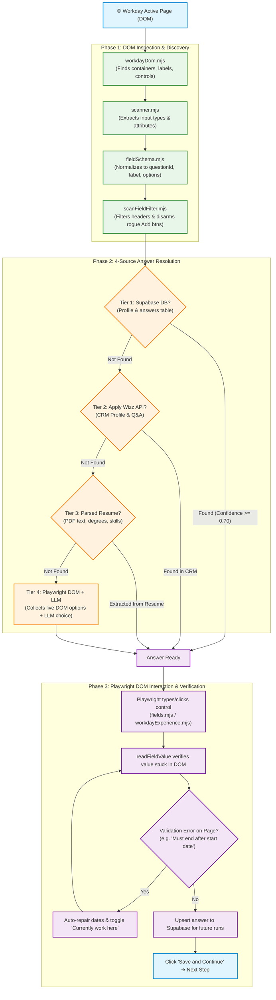

# Workday Auto-Apply: DOM Scanning, Pipeline Flow & 4-Tier Answer Resolution Architecture

This report details how Playwright inspects the Workday DOM, how question labels and input controls are extracted, which backend files process them, and how answers are resolved across the **4 data sources** in hierarchical order.

---

## 1. How Playwright Scans the DOM

Workday builds complex, dynamic web applications with deeply nested `div` hierarchies, ARIA wrappers, custom dropdown menus, and styled inputs. Playwright scans the page in real-time through four dedicated files:

```
Workday Web Page (DOM)
       │
       ▼
[lib/workdayDom.mjs] ────────► Scrapes formField containers, finds labels & control types
       │
       ▼
[lib/scanner.mjs] ───────────► Evaluates DOM in-page to detect interactive questions
       │
       ▼
[lib/interaction/fieldSchema.mjs] ──► Normalizes DOM into structured field objects
       │
       ▼
[lib/scanFieldFilter.mjs] ───► Filters out chrome, static text, and risky "Add" buttons
```

### Key Responsibilities by File:

1. **[`lib/workdayDom.mjs`](lib/workdayDom.mjs)**
   - **Container Detection:** Finds all Workday question containers using selectors like `[data-automation-id*="formField"]`, `fieldset[role="group"]`, and `[data-automation-id*="form-field"]`.
   - **Label Resolution:** Resolves label text through multiple strategies:
     - Native HTML `<label for="...">` matching input ID.
     - Elements with `aria-labelledby` referencing heading/label elements.
     - Section headings (`legend`, `h2`, `h3`, `[data-automation-id*="formLabel"]`).
     - Cleans asterisks (`*`), whitespace, and suffixes (`"select one"`, `"required"`).
   - **Live Option Extraction (`collectLiveFieldOptions`):** Reads visible or dropdown options (`[role="option"]`, `[role="radio"]`, `[role="checkbox"]`, `[data-automation-id="promptOption"]`) so the answer engine knows the exact choices permitted on screen.

2. **[`lib/scanner.mjs`](lib/scanner.mjs)**
   - Executes `scanWorkdayFields(page)` in the browser context.
   - Categorizes controls into:
     - `text` / `textarea`
     - `dropdown` / `combobox`
     - `radio` / `radiogroup`
     - `checkbox`
     - `date` / `monthyear` (spin maps)
     - `typeahead` / `searchable`

3. **[`lib/interaction/fieldSchema.mjs`](lib/interaction/fieldSchema.mjs)**
   - Normalizes raw DOM elements into structured schemas:
     ```javascript
     {
       questionId: "q_1",
       label: "Are you legally authorized to work in the United States?",
       fieldType: "radio", // dropdown, text, date, checkbox
       options: ["Yes", "No"],
       required: true,
       selector: "[data-automation-id='formField-workAuth']"
     }
     ```

4. **[`lib/scanFieldFilter.mjs`](lib/scanFieldFilter.mjs)**
   - Discards non-question UI elements, search headers, and rogue "Add" buttons (e.g. Add Certifications or Add Languages that would trap the application if clicked).

---

## 2. Where Scanned Questions Go in the Backend

Once Playwright extracts the normalized fields from the DOM, the execution flow is coordinated by:

```
[lib/orchestrator/workdayPageWorkflow.mjs]
       │
       ├─► Step 1: My Information ──────► [lib/workdayQuestionFill.mjs] (Contact & Demographics)
       │
       ├─► Step 2: My Experience ────────► [lib/workdayExperience.mjs] (Work History, Degree, Dates)
       │                                       └─► [lib/workdayDateFill.mjs] (From/To spin calendar)
       │
       ├─► Step 3: Application Questions ► [lib/questionEngine/pageAnswerEngine.mjs]
       │                                       └─► [lib/clientAnswer.mjs] (4-Tier Resolver)
       │
       └─► Step 4: Voluntary Disclosures ─► [lib/answerConcepts.mjs] (EEO, Veteran, Disability)
```

1. **[`lib/orchestrator/pageLoop.mjs`](lib/orchestrator/pageLoop.mjs)**
   - Analyzes the page to detect which step of the Workday wizard is active.
   - Routes control to the specialized handler for that step.

2. **[`lib/workdayExperience.mjs`](lib/workdayExperience.mjs)**
   - Handles the **My Experience** page: Job Title, Company, Location, From/To dates, "I currently work here", School/University, Degree, and Field of Study.
   - Uses direct input targeting, level-aware degree matching, and post-fill self-repair if dates conflict.

3. **[`lib/questionEngine/pageAnswerEngine.mjs`](lib/questionEngine/pageAnswerEngine.mjs)**
   - Coordinates the evaluation of application questions, legal authorizations, and custom employer questionnaires.
   - For every question, calls the 4-tier answer resolution engine.

---

## 3. How Answers Are Fetched: The 4 Sources

The system uses a strict hierarchical resolution pipeline. A lower tier is **only consulted if the higher tier does not contain the answer**:

```
                  Question & Live Options from DOM
                                │
                                ▼
 ┌─────────────────────────────────────────────────────────────┐
 │ TIER 1: Supabase Database (Highest Priority / Truth Source) │
 └──────────────────────────────┬──────────────────────────────┘
                                │ (If Not Found)
                                ▼
 ┌─────────────────────────────────────────────────────────────┐
 │ TIER 2: Apply Wizz CRM API Profile                          │
 └──────────────────────────────┬──────────────────────────────┘
                                │ (If Not Found)
                                ▼
 ┌─────────────────────────────────────────────────────────────┐
 │ TIER 3: Parsed Resume Facts (PDF Extraction)                │
 └──────────────────────────────┬──────────────────────────────┘
                                │ (If Not Found)
                                ▼
 ┌─────────────────────────────────────────────────────────────┐
 │ TIER 4: LLM Analysis with Playwright Live DOM Options       │
 └─────────────────────────────────────────────────────────────┘
```

### Detailed Breakdown of the 4 Sources:

#### Source 1: Supabase Database (Tier 1)
- **Files:** [`lib/supabaseClient.mjs`](lib/supabaseClient.mjs), [`lib/clientAnswer.mjs`](lib/clientAnswer.mjs)
- **What it checks:**
  1. **`clients` and `client_additional_information` tables:** Loads verified candidate facts (full name, company email, mobile phone, latest company, job title, work dates, current working status, university, degree, GPA).
  2. **`answers` / `client_questions` table:** Looks up previously saved answers for this client ID (`lookupSupabaseAnswerSync`). If an answer was saved with confidence $\ge 0.70$, it is used immediately.
- **Why it comes first:** Supabase holds human-curated and customer-approved data. If an answer exists here, it is 100% authoritative and skips external API calls.

#### Source 2: Apply Wizz CRM API (Tier 2)
- **Files:** [`lib/applyWizzClient.mjs`](lib/applyWizzClient.mjs), [`lib/profileBootstrap.mjs`](lib/profileBootstrap.mjs)
- **What it checks:**
  - If a specific field or question is not yet in Supabase (e.g., fresh client import), calls the Apply Wizz CRM endpoint `GET /api/client-details`.
  - Builds a comprehensive Q&A index (`apiQaIndex`) covering work authorization, salary expectations, relocation, and background preferences.
  - Automatically syncs and persists any fetched API data into Supabase for future runs.

#### Source 3: Parsed Resume Facts (Tier 3)
- **Files:** [`lib/applyWizzResume.mjs`](lib/applyWizzResume.mjs), [`lib/resumeParser.mjs`](lib/resumeParser.mjs)
- **What it checks:**
  - When employer-specific technical questions appear (e.g., *"How many years of experience do you have with Kubernetes?"* or *"What is your degree major?"*), the engine queries the parsed resume text:
    - Extracts candidate's actual university name (e.g., *"University of Memphis"*).
    - Extracts exact major and specialization (e.g., *"Computer Science"*).
    - Calculates technology-specific years of experience based on work history sections.
    - Extracts skills listed in the CORE SKILLS blocks.
  - Caches extracted facts into Supabase under `source: 'resume'`.

#### Source 4: Playwright DOM + LLM Dynamic Resolver (Tier 4)
- **Files:** [`lib/openRouterLlm.mjs`](lib/openRouterLlm.mjs) ([`pickNearestSelectOption`](lib/openRouterLlm.mjs#L924) and [`resolveUnknownWithLlm`](lib/openRouterLlm.mjs#L1140))
- **How it functions like a human:**
  - If the question is unique to that company and not found in Sources 1-3:
    1. Playwright clicks the dropdown or scans the question container to collect the **exact list of visible options on screen** (e.g. `["Master's Degree", "Bachelor's Degree", "Other"]`).
    2. Packages the prompt:
       - Question label
       - Live options from DOM
       - Candidate's complete profile & resume facts
       - Company name
    3. Calls the OpenRouter LLM (`gemini-2.5-flash` / configured model).
    4. The LLM selects the exact option from the live list that best matches the candidate's background.
    5. The chosen option is returned, clicked by Playwright, and saved back to Supabase so it never has to be asked again.

---

## 4. How Playwright Injects the Answer into Workday

Once an answer is resolved from one of the 4 sources, Playwright handles the physical interaction:

- **Text Inputs:** [`fillTextAggressive`](lib/workdayExperience.mjs#L673) clicks, fills, tabs, and verifies `inputValue()`.
- **Searchable Dropdowns:** [`typeAndClickOption`](lib/fields.mjs#L461) opens the prompt, types query, waits for popup options, and clicks the matching item.
- **Calendar Spins:** [`fillWorkdayDateField`](lib/workdayDateFill.mjs#L519) types month and year digits sequentially without breaking focus.
- **Radio Buttons / Checkboxes:** Checks state, clicks, and dispatches native `change` events.
- **Verification:** [`readFieldValue`](lib/workdayExperience.mjs#L620) reads the value from the DOM to ensure it stuck before proceeding.
- **Self-Repair:** If Workday displays an inline validation error (e.g. *"Must end after start date"*), the post-fill repair logic intercepts and auto-fixes the field.

---

## 5. End-to-End Mermaid Architecture Flowchart


